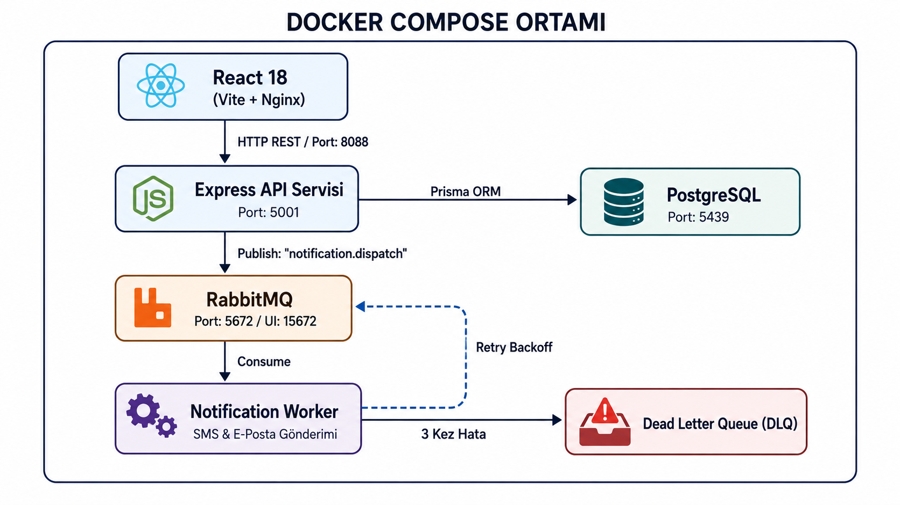
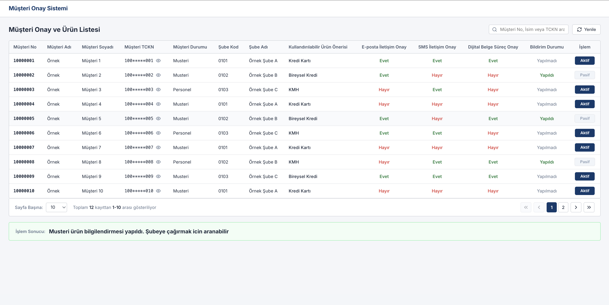
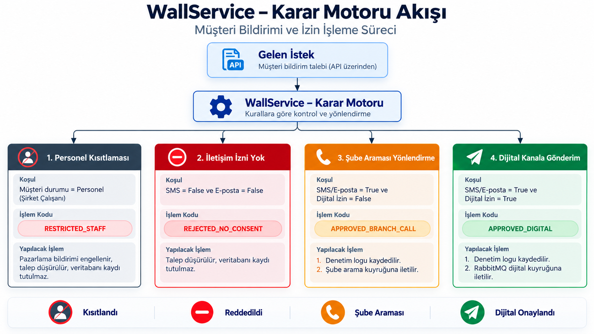
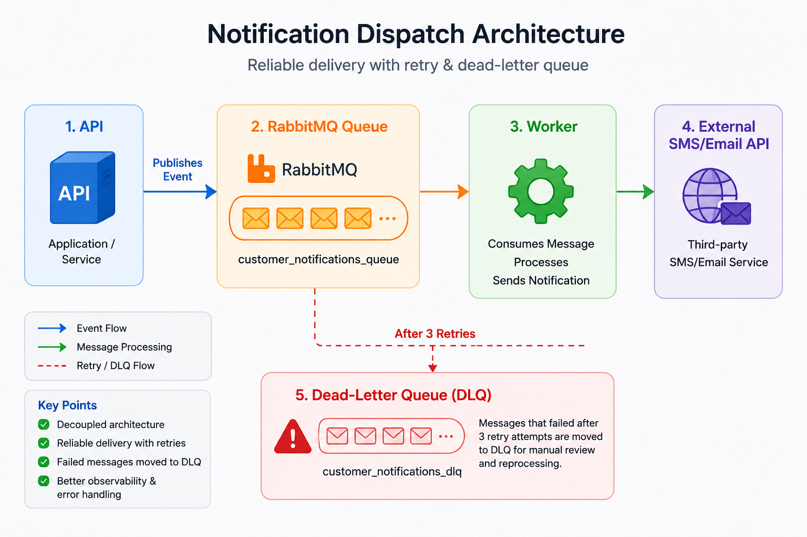

# Fintech Customer Consent & Notification Hub

Bankacılık müşteri ürün bilgilendirme ve iletişim onay süreçlerini yöneten; **PostgreSQL**, **Prisma ORM**, **RabbitMQ** asenkron mesaj kuyruğu, **Notification Worker** servisi ve **Docker Compose** orkestrasyonuna sahip kurumsal TypeScript monorepo platformu.

---

## Sistem Mimarisi



---

## Kullanıcı Arayüzü (UI Dashboard)




---

## Proje Dizin Hiyerarşisi

```
fintech-consent-hub/
├── client/                     # React 18, Vite, Clean Fintech Design System
│   ├── src/components/         # Tablo, Sayfalama, Rozetler ve Maskeleme
│   ├── src/hooks/              # State ve Sayfalama Yönetimi
│   ├── src/services/           # HTTP API İstemcisi
│   ├── Dockerfile              
│   └── nginx.conf              
│
├── server/                     # Express.js REST API & Transactional Outbox Relay
│   ├── prisma/                 # Schema & Migrations
│   ├── src/controllers/        # REST API Denetleyicileri
│   ├── src/services/           # Wall Kural Motoru, Outbox Relay, Entity DB
│   ├── src/repositories/       # PostgreSQL Repositories (Customer, Outbox, Logs)
│   ├── src/middlewares/        # Correlation ID (Tracing) & Metrics (High Cardinality Defense)
│   ├── src/config/             # Prometheus Metrics Registry, RabbitMQ, Prisma
│   ├── src/tests/              # Jest & Ts-Jest Entegrasyon Testleri
│   └── Dockerfile              
│
├── worker/                     # Asenkron Bildirim Tüketicisi & Idempotent Inbox
│   ├── src/index.ts            # RabbitMQ Consumer & Processed Messages Dedup
│   ├── src/metrics.ts          # Worker Prometheus Metrik Sunucusu (:5002)
│   └── Dockerfile             
│
├── monitoring/                 # Observability as Code
│   ├── prometheus/             # Prometheus Scraping Konfigürasyonu
│   └── grafana/                # Otomatik Panolar ve Veri Kaynakları
│
├── docs/                       # Mimari Şemaları ve Ekran Görüntüleri
│   └── images/                 
│
├── .github/workflows/          # GitHub Actions CI Pipeline (ci.yml)
├── docker-compose.yml          # Tüm Servislerin Orkestrasyonu
└── package.json                # Monorepo Workspace Konfigürasyonu
```

### Karar Matrisi

| Senaryo | Müşteri Statüsü | İletişim Onayı (SMS / E-posta) | Dijital Belge Onayı | İşlem Kodu | Açıklama | DB Kaydı & RabbitMQ Event |
| :--- | :--- | :--- | :--- | :--- | :--- | :--- |
| **Kısıtlı Personel** | `Personel` | Herhangi (`true`/`false`) | Herhangi (`true`/`false`) | `RESTRICTED_STAFF` | Banka personeli statüsündeki müşterilere standart ürün pazarlama bildirimi yapılamaz. | Kaydedilmez, kuyruğa mesaj atılmaz |
| **İletişim Onaysız** | `Musteri` | İkisi de `false` | --- | `REJECTED_NO_CONSENT` | İletişim onayı bulunmamaktadır. | Kaydedilmez, kuyruğa mesaj atılmaz |
| **Şube Yönlendirme** | `Musteri` | En az biri `true` | `false` | `APPROVED_BRANCH_CALL` | Musteri ürün bilgilendirmesi yapıldı. Şubeye çağırmak icin aranabilir | PostgreSQL'e kaydedilir, kuyruğa aktarılır |
| **Dijital Akış** | `Musteri` | En az biri `true` | `true` | `APPROVED_DIGITAL` | Musteri ürün bilgilendirmesi yapıldı.Surec dijital olarak devam ettirilebilir | PostgreSQL'e kaydedilir, kuyruğa aktarılır |



---

## Kurulum ve Çalıştırma

Tüm sistemi (PostgreSQL, RabbitMQ, API, Worker ve Frontend) tek komutla ayağa kaldırmak için:

```bash
docker compose up --build
```

Arka planda çalıştırmak için:
```bash
docker compose up -d
```

### Servis Erişim Adresleri ve Portlar

| Servis | Adres | Açıklama / Kimlik Bilgileri |
| :--- | :--- | :--- |
| **Ön Yüz (Client)** | `http://localhost:8088` | React web kullanıcı arayüzü |
| **Arka Uç (API)** | `http://localhost:5001/api` | Express REST API uç noktaları |
| **Prometheus Metrikleri (API)** | `http://localhost:5001/metrics` | API RED & Outbox işleme metrikleri |
| **Prometheus Metrikleri (Worker)** | `http://localhost:5002/metrics` | Worker tüketici & Idempotency metrikleri |
| **Grafana Dashboard** | `http://localhost:3000` | Önceden yapılandırılmış Fintech Metrik Panosu (Anonim Giriş Aktif) |
| **Prometheus Sunucusu** | `http://localhost:9090` | Zaman serisi veritabanı ve metrik sorgulama paneli |
| **RabbitMQ Yönetim Paneli** | `http://localhost:15672` | **Kullanıcı:** `guest` \| **Şifre:** `guest` |
| **PostgreSQL Veritabanı** | `localhost:5439` | **DB:** `musteri_onay_db` \| **Kullanıcı:** `postgres` |

---

## API Uç Noktaları

### 1. Müşteri Listesi 
- **Method:** `GET`
- **Path:** `/api/customers`
- **Query Parameters:**
  - `page` *(default: 1)*: İstenen sayfa numarası
  - `limit` *(default: 10, max: 100)*: Sayfa başına satır sayısı
  - `search` *(optional)*: Müşteri no, ad, soyad, TCKN veya şube filtresi

### 2. Bildirim İşleme (Wall Servisi & Event Dispatch)



- **Method:** `POST`
- **Path:** `/api/wall/process-notification`
- **Request Body (JSON):**
```json
{
  "musteriNo": "10000001",
  "musteriAdi": "Örnek",
  "musteriSoyadi": "Müşteri 1",
  "musteriTckn": "10000000001",
  "musteriDurumu": "Musteri",
  "subeKod": "0101",
  "subeAdi": "Örnek Şube A",
  "kullandirilabilirUrun": "Kredi Kartı",
  "epostaOnay": true,
  "smsOnay": true,
  "dijitalBelgeSurecOnay": true,
  "islemYapanSicil": "P10842"
}
```
- **Response Body (JSON):**
```json
{
  "islemKodu": "APPROVED_DIGITAL",
  "islemAck": "Musteri ürün bilgilendirmesi yapıldı.Surec dijital olarak devam ettirilebilir"
}
```

---

## Testler ve Doğrulama

Tüm testler **Jest**, **ts-jest** ve **Supertest** kullanılarak BDD (Behavior-Driven Development) standartlarında yazılmıştır. Assert scriptleri yerine izole describe/it blokları ve coverage raporlama kullanılmaktadır.

```bash
# Tüm çalışma alanlarını (Server, Worker, Client) derleme
npm run build

# Tüm entegrasyon ve BDD test paketlerini çalıştırma (9 Suite, 51 Test PASS)
npm test

# Detaylı kod kapsama (Coverage) raporunu üretme
npm run test:coverage

# Modüler test paketleri
npm run --prefix server test:unit         # WallService & Kural Motoru
npm run --prefix server test:security     # Güvenlik & Anti-Spoofing Doğrulaması
npm run --prefix server test:e2e          # E2E Tam Akış & Sayfalama
npm run --prefix server test:relay        # Transactional Outbox Relay & Publisher Confirms
npm run --prefix server test:idempotency  # Idempotent Consumer & Inbox Deseni (P2002 Yarış İzolasyonu)
npm run --prefix server test:trace        # Dağıtık İzleme (X-Correlation-ID Propagasyonu)
npm run --prefix server test:metrics      # Prometheus RED Metrikleri & High Cardinality Savunması
```

